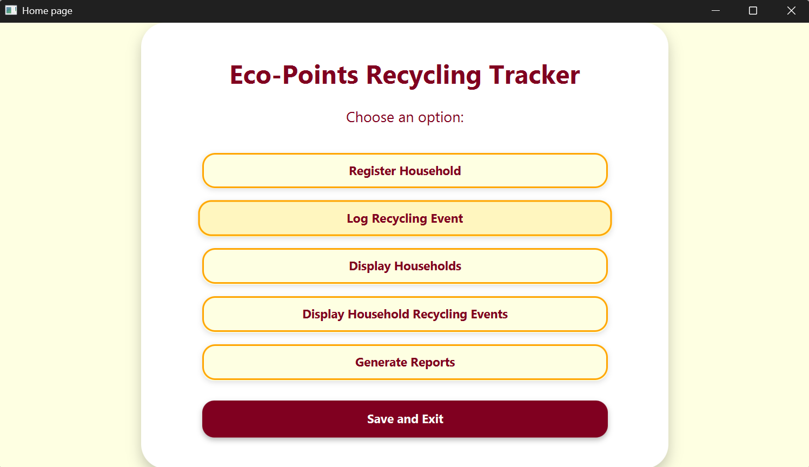
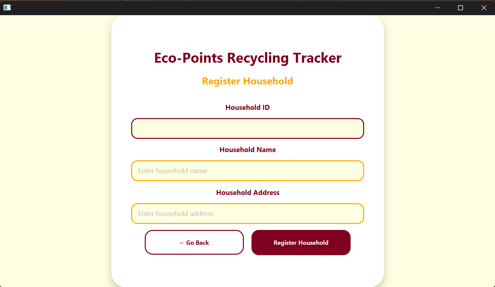
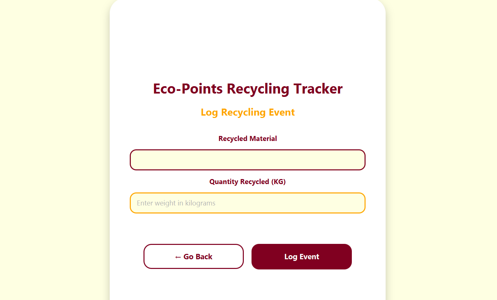

# Eco-Points Recycling Tracker

This is an app where you can register multiple households and log how much recycling each household has done, the app will then grant you EcoPoints accordingly

## Technologies

- Java
- JavaFX

## Features

- Household registration
- Recycling event logging
- Database storage (Serialization)
- Dashboard

## Screenshots

### Home Page

### Register Household

### Log Recycling Event

## How to Run

1. Clone the repository.
2. Open the project in NetBeans.
3. Run the application through the JavaApplication6.java file.
